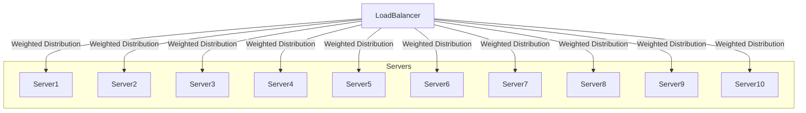
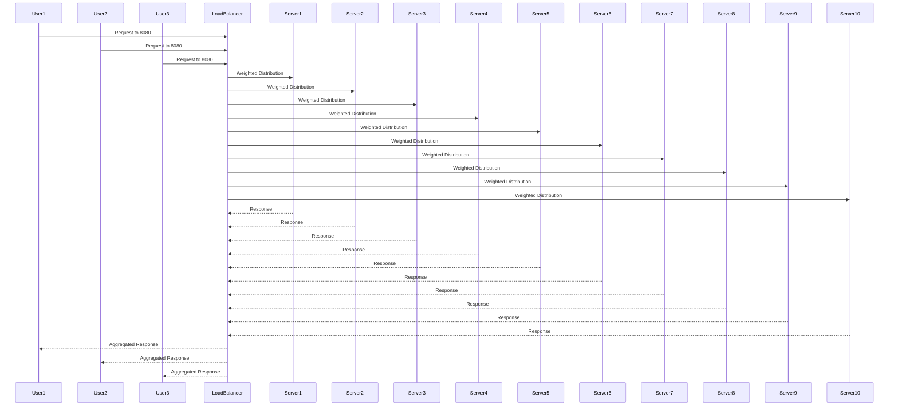

<div align="center">
<h1><b>ExpressBalancify</b></h1>
<p>Express.js-based load balancer that uses a weighted round-robin algorithm to distribute incoming requests across multiple servers.</p>
<p>
  <a href="https://medium.com/@hendurhance/how-to-build-a-weighted-round-robin-load-balancer-in-node-js-23f3f0364860">Read the article on Medium</a>
    ·
  <a href="https://github.com/sponsors/hendurhance">Sponsor</a>
    ·
  <a href="https://twitter.com/hendurhance">Follow me on Twitter</a>
</p>
</div>

**Note: An article on this project is available on [Medium](https://medium.com/@hendurhance/how-to-build-a-weighted-round-robin-load-balancer-in-node-js-23f3f0364860), check it out.**
    

## Table of Contents
- [Overview](#overview)
  - [Introduction](#introduction)
  - [Load Balancing](#load-balancing)
  - [Weighted Round Robin Algorithm](#weighted-round-robin-algorithm)
  - [Request Distribution](#request-distribution)
- [Usage](#usage)
    - [Prerequisites](#prerequisites)
    - [Installation](#installation)
- [Logging](#logging)
- [Contributing](#contributing)
- [License](#license)
- [Author](#author)
- [Support](#support)


## Overview
### Introduction
A load balancer is a crucial component in distributing incoming network traffic across multiple servers to ensure optimal resource utilization, maximize throughput, and minimize response time. This document provides an overview of how a simple load balancer works, focusing on a scenario with ten servers and using a Weighted Round Robin algorithm.

### Load Balancing
In our example, we have ten servers, each assigned a specific weight. The weight represents the server's capacity to handle requests, and it influences the distribution of incoming traffic.


### Weighted Round Robin Algorithm
The load balancer employs a Weighted Round Robin algorithm to distribute incoming requests among the servers. This algorithm takes into account the weights assigned to each server and aims to maintain a balance in the workload.

The algorithm operates as follows:

- Servers are configured with specific weights reflecting their capacity.
- The load balancer maintains an index pointing to the current server in rotation.
- For each incoming request, the load balancer selects the next server in a round-robin fashion based on the server weights.
- The server index is updated, and the process repeats.

### Request Distribution
When a user makes a request to the load balancer, the Weighted Round Robin algorithm determines which server should handle the request. The algorithm considers the server weights, directing traffic to servers with higher capacities more frequently. Here is a visual representation of the load balancer distributing requests among the servers using the Weighted Round Robin algorithm:


This diagram visually represents the flow of requests from users through the load balancer to the servers, demonstrating the Weighted Round Robin algorithm in action. The load balancer ensures an even distribution of requests based on the specified weights, optimizing the performance of the entire system.


## Usage
### Prerequisites
- Node.js
- npm
- Python 3
- npx
- pm2

### Installation
1. Clone the repository
```bash
git clone https://github.com/hendurhance/express-balancify.git
```
2. Change directory
```bash
cd express-balancify
```
3. Install dependencies
```bash
npm install
```
4. Start the servers
```bash
npm run start
```
5. Start the load balancer
```bash
npm run start:balancer
```
6. Test the load balancer
> The available routes are `/`, `/api`. You can access the load balancer at `http://localhost:8000` health check route and `http://localhost:8000/api` for the API route.

| Route | Description |
| --- | --- |
| `/` | It is an health check route that returns a JSON object with the message |
| `/api` | It is a route that returns a JSON object of a sales sample data of up to 3000 records |

To test the load balancer, you can use the following command:
```bash
# Health check route
npm run test:load:health 

# API route
npm run test:load:api
```
This will send 1200 requests to the load balancer and 400 concurrent requests at a time. You can change the number of requests and concurrent requests by changing the values of in the `package.json` file.

## Logging
Requests and their details, such as timestamp, IP address, server port, and original URL, are logged to a CSV file (`request_logs.csv`). The log file contains the following information:
```bash
# Log file content
Timestamp,IP Address,Server Port,Original URL
2023-12-17T17:39:46.250Z,::1,5673,/
```
You can analyze the log file using the run the following command:
```bash
npm run analyze
```
The script generates a report and visualizations, including bar charts for the distribution of requests between server ports, the highest amount of requests handled by each server, and a pie chart showing the percentage distribution of requests between server ports.

## Contributing
Feel free to contribute to this project by opening issues or submitting pull requests. Your feedback and contributions are highly appreciated.

## License
This project is licensed under the MIT License. See the [LICENSE](LICENSE) file for details.

## Author
- Endurance - [Github](https://github.com/hendurhance) - [Twitter](https://twitter.com/hendurhance) - [LinkedIn](https://www.linkedin.com/in/hendurhance/)

## Support
If you found this project useful, please consider starring it. You can also [buy me a coffee](https://www.buymeacoffee.com/hendurhance) ☕️ or become a sponsor using the links below ➡️ [github sponsors](https://www.github.com/sponsors/hendurhance). Thanks a bunch for your support!
